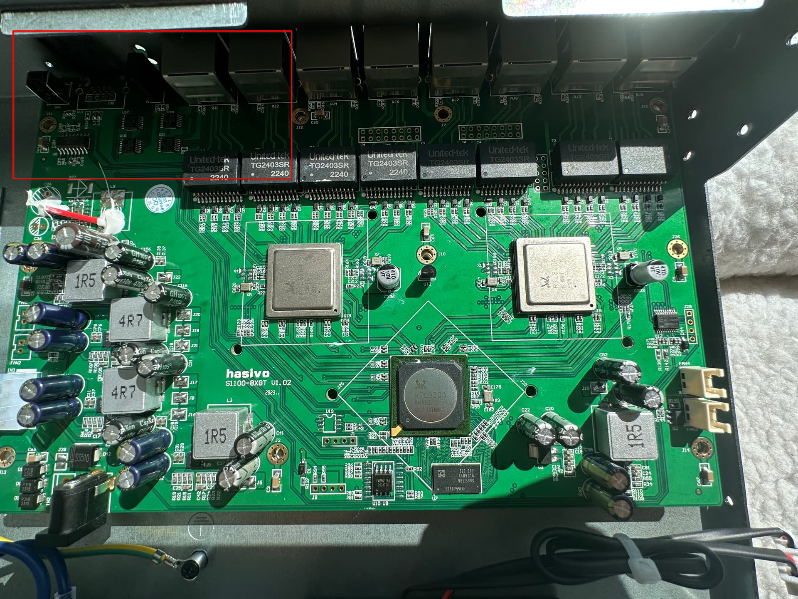
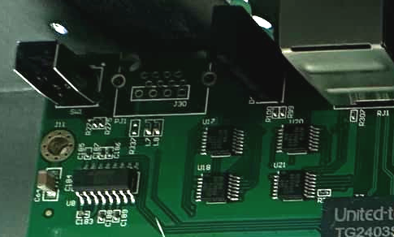
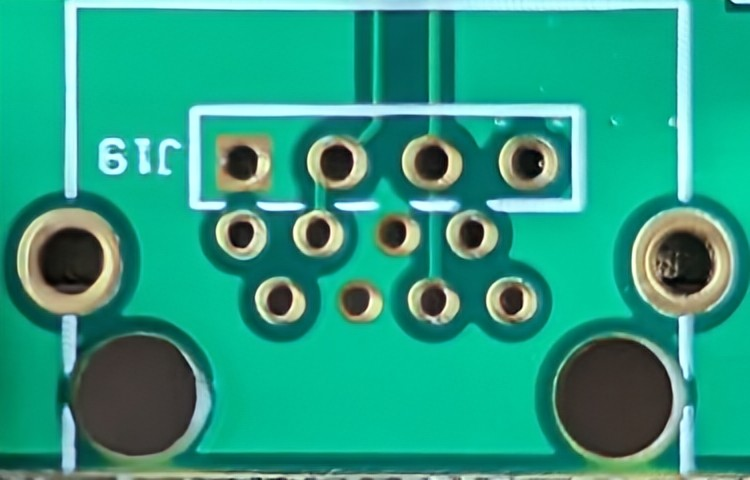
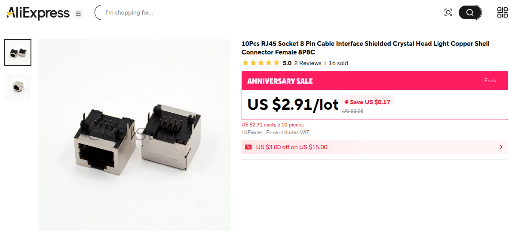
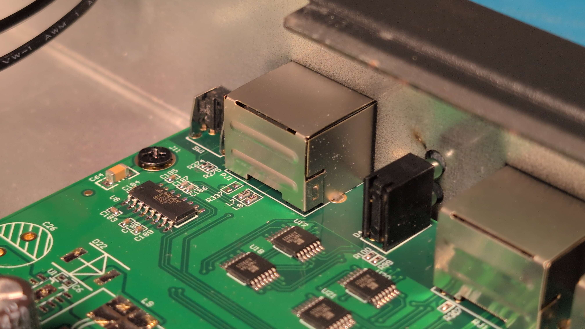
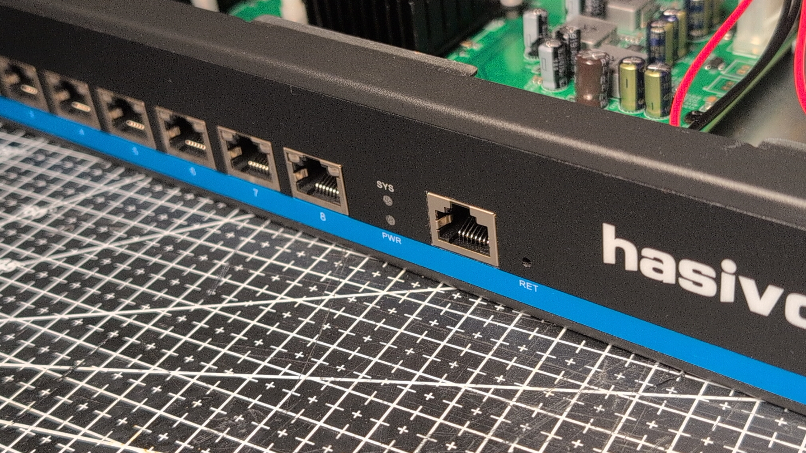
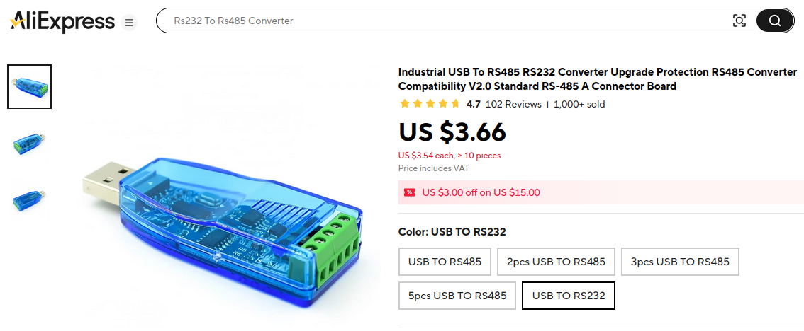
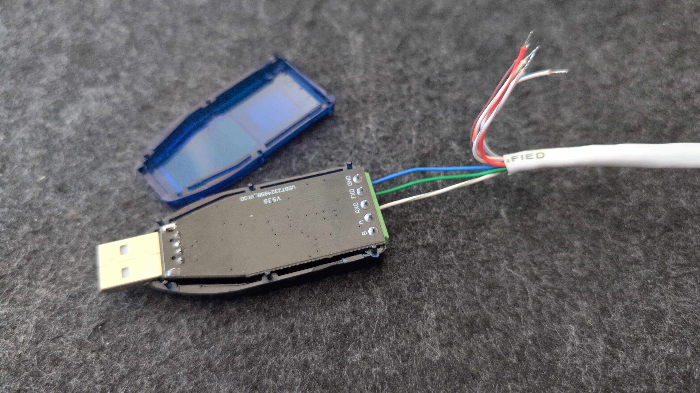
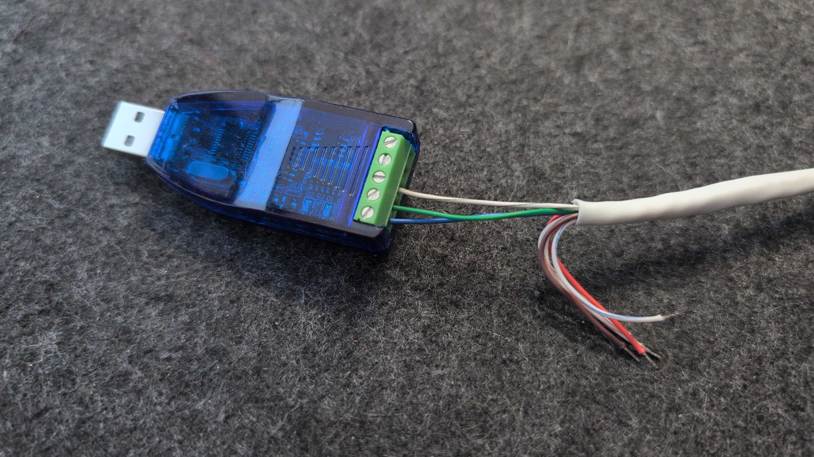

# Flashing OpenWrt on Hasivo S1100W-8XGT-SE

> Tested with OpenWrt 25.12.0 (`r32713-f919e7899d`), platform `realtek/rtl930x`

## Why this switch?

The **Hasivo S1100W-8XGT-SE** is, at the time of writing, one of the **_only cheap_ managed 8-port 10GbE** switches that supports **OpenWrt**.

By replacing its stock closed source firmware, one basically supercharges this switch with little-to-no investments — SSH, VLANs, firewall, LuCI web UI, Ansible-ready, on a well-known, actively maintained OS.

The RTL9303 SoC on which this switch is based, has upstream OpenWrt support ([PR #17137](https://github.com/openwrt/openwrt/pull/17137)).

## Overview

The install is two-phase:

1. **TFTP boot** the OpenWrt initramfs image into RAM via U-Boot _(stock firmware is intact)_
2. **sysupgrade** from within that live system to permanently write OpenWrt to flash

For that, you will need **serial console** access (RS232 via the unpopulated RJ45 pads on the PCB, see [Part 1](#part-1--serial-console-hardware)) and a **direct Ethernet link** to the switch.

## Prerequisites

#### Hardware:

> [!WARNING]
> Do **not** use a plain USB-to-TTL adapter — this board uses a **_3PEAK 3232_ RS-232 transceiver** (RS-232 voltage levels).
> Your adapter must include a voltage-shifting IC (e.g. MAX202) to avoid damaging your hardware.

- USB-to-RS232 adapter _(CH340T-based works well)_
  
- **One of** the following for the console connection (see [Part 1](#part-1--serial-console-hardware) for details):
  - _Solder_ through-hole **RJ45 socket**, or 
  - _Solder_ through-hole **Header pins**, or 
  - **Bare wires** inserted into the through-holes + some tape _(for one-off upload)_

- **Twisted pair cable** matching with selectied connection method _(USB-to-RS232 -> Switch)_

- **Ethernet cable** _(Personal Computer -> Switch LAN Port)_


#### Software:

- `minicom` (or any other serial terminal)
- `podman` or `docker` (for the TFTP server — no host packages needed), **or** `tftpd-hpa` if you prefer
- Two **firmware images** from the [OpenWrt Firmware Selector](https://firmware-selector.openwrt.org) (search `hasivo`):
  - `openwrt-*-initramfs-kernel.bin` — the TFTP boot image (runs in RAM)
  - `openwrt-*-squashfs-sysupgrade.bin` — the permanent flash image

---

## Part 1 — Serial Console Hardware

The S1100W-8XGT-SE has a _**3PEAK 3232**_ RS-232 transceiver IC and through-hole pads for an RJ45 console port — but the connector is **not populated from the factory**.

<p float="left">
  
  
</p>

<p align="center">
  
</p>

You have three options for connecting to these pads:

### Option A: Solder an RJ45 socket (best)

> [!NOTE]
> Note that the RJ45 socket **covers the adjacent header pin holes**, so this won't work with _Option B_.

This is the best option because you add a real console port to the switch.

Standard through-hole RJ45 socket on AliExpress:

<p align="center">
  
</p>

Solder it into the through-holes. 

After soldering:

<p align="center">
  
</p>

The metal enclosure **has already a cutout in the right position**, but the front label sticker covers it.
Score along the port outline from the inside and finish corners from outside with a blade and peel it away.


<p align="center">
  
</p>

### Option B: Solder header pins (internal)

> [!NOTE]
> Note that the headers **obstruct the body of the RJ45 body**, so this won't work with _Option A_.

There are separate through-holes next to the RJ45 landing pads that can take standard 2.54mm header pins.
These are more compact if you don't want a full RJ45 jack sticking out and want easy internal access, but as noted above — the RJ45 socket physically covers these holes, so pick one or the other.

### Option C: Bare wires + tape (temporary)

If you just need console access for the initial flash and don't plan to keep a permanent console port, strip three wires from a patch cable, insert them into the correct through-holes, and hold them in place with tape.
The worst that can happen is a wire slips out mid-session — just reseat and retry.

### 3PEAK 3232 IC pinout

The three pins you care about on the 3PEAK 3232 IC connect directly to the RJ45 through-hole pads:

<!-- TODO: add annotated closeup photo of PCB showing PEAK3232 IC with arrows to pins 13 (RIN1), 14 (TOUT1), 15 (GND) and their corresponding through-hole pads -->
<!--  -->

### What to buy (adapter side)

A CH340T-based USB-to-RS232 adapter with screw terminals:


<p align="center">
  
</p>

### Wiring

Cut one end off a standard T568B patch cable and connect three wires to the CH340T adapter's screw terminals:

| PEAK3232 Pin | RJ45 Wire (T568B) | Signal | CH340T Terminal |
|---|---|---|---|
| PIN 13 (RIN1) | Green (pin 6) | Switch RX ← adapter TX | **TXD** |
| PIN 14 (TOUT1) | White/Green (pin 3) | Switch TX → adapter RX | **RXD** |
| PIN 15 (GND) | Blue (pin 4) | Ground | **GND** |

Only these three wires are needed. Leave the rest unconnected.

<div style="display: flex; gap: 8px;">
  
  
</div>

### Connecting to the serial console

Plug the USB adapter into your workstation. Verify it shows up:

```bash
dmesg | tail   # should show ch341-uart converter now attached to ttyUSB0
```

Open the serial console (**38400 8N1**):

```bash
minicom -D /dev/ttyUSB0 -b 38400
```

You should see output when the switch is powered on. If not, swap RXD/TXD — that's the most common wiring mistake.

---

## Part 2 — TFTP Boot (Phase 1)

This boots OpenWrt into RAM via the switch's U-Boot bootloader over a direct Ethernet link. Nothing is written to flash.

### 2.1 — Configure your workstation's wired interface

U-Boot has a **hardcoded** TFTP server address of `192.168.0.111`. Your workstation must be at that IP on the wired interface connected to port 1 of the switch.

Set it **statically** (not DHCP):

| Field | Value |
|---|---|
| Address | `192.168.0.111` |
| Netmask | `255.255.255.0` |
| Gateway | *(leave empty)* |

Verify:

```bash
ip addr show <wired-interface>
# Must show: inet 192.168.0.111/24
```

### 2.2 — Start the TFTP server

Using a container (no host packages or system-wide install needed):

```bash
# Place the initramfs image in a directory and serve it
mkdir -p ~/tftp-root
cp openwrt-*-initramfs-kernel.bin ~/tftp-root/

# Run a disposable TFTP server container
sudo podman run --rm --net=host \
  -v ~/tftp-root:/tftpboot:ro \
  docker.io/3x3cut0r/tftpd-hpa
```

> Replace `podman` with `docker` if that's what you have. `--net=host` is needed because TFTP uses ephemeral UDP ports for data transfer — NAT breaks this. Port 69/udp is privileged, so `sudo` is required regardless of method (unless you set `net.ipv4.ip_unprivileged_port_start=0`). The container exits on Ctrl+C.

<details>
<summary>Alternative: tftpd-hpa (if you prefer a host package)</summary>

```bash
sudo apt install tftpd-hpa
sudo cp openwrt-*-initramfs-kernel.bin /srv/tftp/
sudo chmod 644 /srv/tftp/*.bin
sudo systemctl start tftpd-hpa
ss -ulnp | grep :69   # confirm listening on UDP 69
```

</details>

### 2.3 — Ensure the firewall isn't blocking TFTP

TFTP uses ephemeral UDP ports for data transfers. Most host firewalls will block these. Flush your rules:

```bash
sudo nft flush ruleset
```

### 2.4 — Interrupt U-Boot

With minicom open on the serial console, power on the switch. **Immediately press ESC** to stop autoboot.

Enter the bootloader password:
```
Hs2021cfgmg
```

Then type the second gate _(yes literally XXXX)_:
```
XXXX
```

You should now be at the U-Boot prompt.

### 2.5 — Set the persistent boot target (first time only)

Tell U-Boot where OpenWrt lives in flash so future boots work automatically:

```bash
setenv bootcmd 'rtk network on; bootm 0xb4300000'
saveenv
```

> The address is SPI base `0xb4000000` + firmware partition offset `0x0300000`.

### 2.6 — TFTP boot the initramfs

```
rtk network on
```

> [!WARNING]
> REPLACE THE INITRAMFS IMAGE WITH ONE YOU HAVE DOWNLOADED
```
tftpboot 0x84f00000 openwrt-*-initramfs-kernel.bin
```

```
bootm 0x84f00000
```

> `rtk network on` initialises the NIC — without it, `tftpboot` times out immediately.

The switch will boot into a **temporary, RAM-only** OpenWrt. Once you see the login prompt on serial, Phase 1 is done.

---

## Part 3 — Permanent Flash (Phase 2)

### 3.1 — Change the switch's LAN IP (important)

The running OpenWrt defaults to `192.168.1.1`. **This collides with most home/office routers.** Change it via serial before doing anything over the network:

```bash
uci set network.lan.ipaddr='10.0.0.1'
uci set network.lan.netmask='255.255.255.0'
uci commit network
service network restart
```

> Pick any free subnet. `10.0.0.1` is used throughout this guide — anything that doesn't collide with your existing network works. If you're certain `192.168.1.0/24` is free on your setup, you can skip this step and keep the default.

Now set your workstation's wired interface to the same subnet (e.g. `10.0.0.2/24`).

### 3.2 — Serve the sysupgrade image

On your workstation:

```bash
cd /path/to/downloaded/images
python3 -m http.server 8080
```

### 3.3 — Flash

SSH into the switch (or use the serial console) and pull the image:

```bash
ssh root@10.0.0.1

wget http://10.0.0.2:8080/openwrt-25.12.0-realtek-rtl930x-hasivo_s1100w-8xgt-se-squashfs-sysupgrade.bin \
  -O /tmp/sysupgrade.bin

sysupgrade -n /tmp/sysupgrade.bin
```

> `-n` discards configuration — correct for a first install.

The switch flashes and reboots automatically. Takes 1–2 minutes.

---

## Post-Install

OpenWrt is now permanently on flash. After reboot:

- LuCI web UI: `http://<switch-ip>` (whatever you set above, or `192.168.1.1` if you kept the default)
- Default login: `root`, **no password**
- **Set a root password immediately** (`passwd` via SSH or through LuCI)

The switch is now fully managed — configure VLANs, trunks, firewall rules, or drop it into your Ansible inventory as you would any other OpenWrt device.

---

## Reference

### SPI Flash Partition Map

| Partition | Offset | Size | Notes |
|---|---|---|---|
| u-boot | `0x0000000` | 896 KiB | **read-only — do not touch** |
| u-boot-env | `0x00e0000` | 64 KiB | |
| u-boot-env2 | `0x00f0000` | 64 KiB | **read-only** |
| jffs | `0x0100000` | 1 MiB | vendor config |
| jffs2 | `0x0200000` | 1 MiB | vendor logs |
| **firmware** | `0x0300000` | **12 MiB** | OpenWrt goes here |
| oeminfo | `0x0f00000` | 1 MiB | **read-only** |

### Stock Firmware Root Shell (not needed for the install)

If you want to poke around the vendor OS before flashing:

**Via serial:** `Ctrl+T` → password: `switchrtk` → press `s`

**Via SSH:** `Ctrl+T` → password: `switchrtk` → type `sys command sh` → log in → `Ctrl+T` again → password: `switchrtk` → press `s`

---

## Troubleshooting

**TFTP shows `T T T T T T` (timeout loop)**

Two things to check: host firewall blocking ephemeral UDP ports (`sudo nft flush ruleset`), the `.bin` file not readable by the TFTP server process.

**Can't SSH/ping the switch after TFTP boot**

Your workstation is probably routing traffic through WiFi instead of the wired interface. Force the route:

```bash
sudo ip route add 10.0.0.0/24 dev <wired-interface>
```

Or if your network manager didn't apply the static IP properly:

```bash
sudo ip addr add 10.0.0.2/24 dev <wired-interface>
```

**Switch boots to stock firmware after flashing**

The `setenv bootcmd` / `saveenv` from step 2.5 didn't stick. Interrupt U-Boot again and repeat it.
